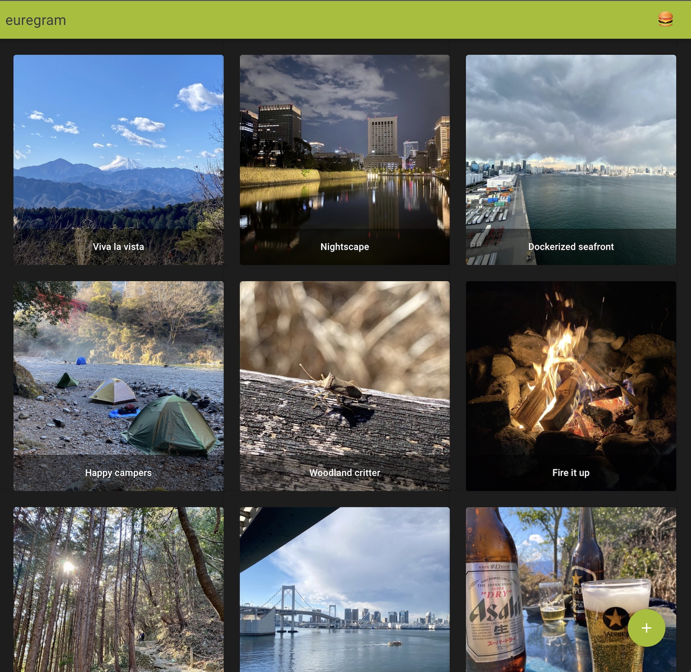
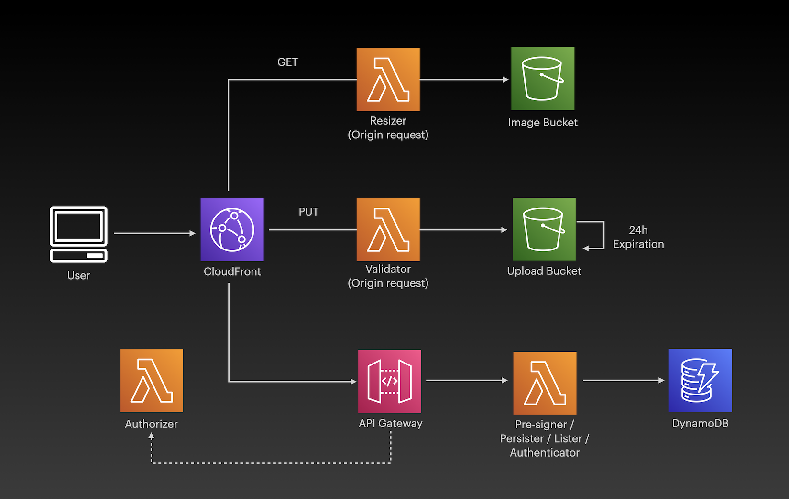
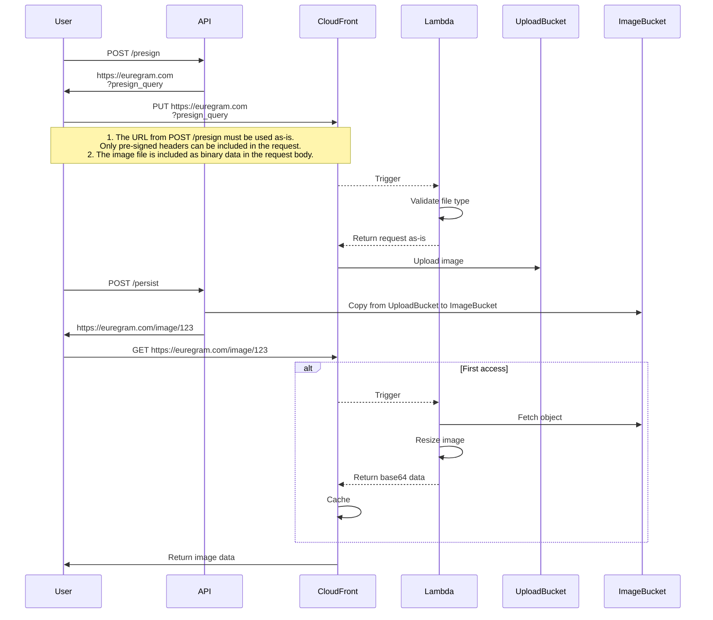
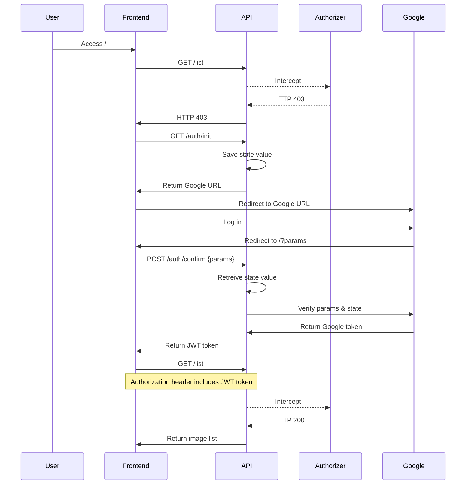

# euregram

### Next-generation image sharing service.



---

## Architecture



---

## Frontend

Vue SPA hosted on S3 behind CloudFront. 

### Run

```
npm install
npm run dev
```

### Deploy

_Note: S3 bucket names and CloudFront distribution ID values must be set in `sls/Makefile`.
(Requires backend deploy be completed first.)_

Run below command in `sls/Makefile`. 
```
make deploy-frontend
```

---

## Backend

Serverless API with API Gateway + Lambda running behind CloudFront. 
DynamoDB as the datastore, and S3 for image files.

Authentication is done with a combination of Google OAuth and a Lambda authorizer.

### Deploy 

_Note: SSM parameters must be set first. (See details below.)_

Run below command found in `sls/Makefile`.

```
make deploy
```

---

## Image Upload Sequence 


---

## Authentication Sequence

_Note: The authentication flow is for demonstration purposes only, and 
was implemented out of pure convenience. Use at your own risk._



---

### SSM Parameters

<details>
<summary>Parameter command list</summary>

### Strings

```
aws ssm put-parameter \
--name "euregram-dev-domain" \
--value "my-domain" \
--type String \
--region "us-east-1"  

aws ssm put-parameter \
--name "euregram-dev-hosted-zone" \
--value "my-hosted-zone-id" \
--type String \
--region "us-east-1"  

aws ssm put-parameter \
--name "euregram-dev-google-redirect-url" \
--value "https://euregram.jimeux.com" \
--type String \
--region "us-east-1"  
```

### SecureStrings

```
aws ssm put-parameter \
--name "euregram-dev-jwt-secret" \
--value "my-secret" \
--type "SecureString" \
--region "us-east-1"

aws ssm put-parameter \
--name "euregram-dev-google-client-id" \
--value "my-google-client-id" \
--type "SecureString" \
--region "us-east-1" 

aws ssm put-parameter \
--name "euregram-dev-google-client-secret" \
--value "my-google-secret" \
--type "SecureString" \
--region "us-east-1" 

```

</details>
